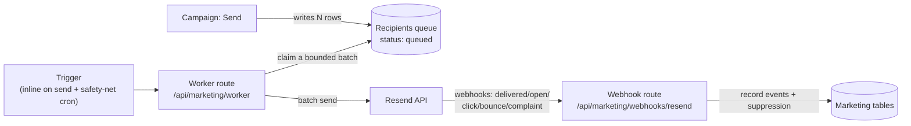

# Marketing — Delivery & Scheduler

How `module-marketing` sends email, how the moving parts fit together, how to set it up for a client app, and what it costs to run.

> **Status:** design reference for the Marketing module (in development). This page is the source of truth for the delivery architecture and per-app setup. Read it before wiring Marketing into a client app.

---

## 1. Mental model

You never send a large campaign in a single request. Sending is a **queue + worker** pipeline:



Three things must exist in a running client app:

1. **A Resend API key** (secret) — provided by the host app (see [Delivery ownership](#2-delivery-ownership-model-a)).
2. **A scheduler** that pokes the worker endpoint on an interval (see [Scheduler](#4-the-scheduler)).
3. **A public webhook URL** Resend calls back to record engagement + suppression.

The **worker** is the heart: each run claims a **bounded batch** (e.g. 100) from the queue, hands it to Resend, marks it sent, and returns. Because every run processes a fixed-size batch, **memory and CPU per run are flat regardless of audience size** — a 1,000-contact send and a 1,000,000-contact send use the same per-run resources; the large one just takes more runs.

---

## 2. Delivery ownership (Model A)

The module is **provider-agnostic in shape but ships only Resend**. It does **not** read secrets from the environment directly. Instead the **host app injects** the Resend key and configuration, exactly like every other module receives its Supabase client from the host.

- **Why:** keeps the package headless and testable (inject a fake sender in tests), lets each client deployment use **its own Resend account and sending cadence**, and stays consistent with the platform's "app owns composition, module owns logic" principle.
- **What the host provides:**
  - `RESEND_API_KEY` (secret) — used by the worker to send.
  - `RESEND_WEBHOOK_SECRET` — used to verify inbound webhooks (svix signature).
  - `MARKETING_WORKER_SECRET` — a shared bearer secret so only the scheduler can invoke the worker route.
  - The public app URL (for building unsubscribe links and the webhook callback).

All of these are environment variables on the client app; the module reads them through an injected config object, never `process.env` directly.

---

## 3. Sending pipeline in detail

1. **Send / schedule** — "Send" writes one **recipients-queue row per eligible contact** (`status = queued`). Eligibility = opted-in to the campaign's topic **AND** not suppressed (see the consent model in the schema doc). A scheduled campaign writes its rows when its send time arrives.
2. **Claim** — each worker run does a single `UPDATE … RETURNING` with row locking to atomically move a batch from `queued → sending`. This makes concurrent worker runs safe: two overlapping runs can never claim the same rows, so **nothing double-sends**.
3. **Send** — the batch is handed to Resend (Resend's batch endpoint sends up to 100 per call). Successes → `sent` with the provider message id; failures → `failed` with `attempt_count++` and a `next_attempt_at` for retry.
4. **Webhooks** — Resend POSTs engagement events (`delivered`, `opened`, `clicked`, `bounced`, `complained`, `unsubscribed`) to the webhook route. The route **verifies the svix signature**, dedupes by provider event id, records the event, and on hard events (`bounced` / `complained` / `unsubscribed`) applies **suppression** so the contact is never emailed again.

**Rate limiting** (batch size + delay between runs) is both a resource control and a way to respect Resend's account limits.

---

## 4. The scheduler

The worker is just an HTTP endpoint — something has to poke it. Two supported approaches. **v1 uses the first; the second is a documented upgrade.**

### 4a. v1 — inline-trigger + GitHub Actions safety-net (recommended to start)

Two parts working together:

- **Inline-trigger on send:** when a campaign is sent (or a workflow step fires), the app **kicks the worker immediately**, fire-and-forget. This drains the common case without waiting for a scheduled tick, so sending feels instant.
- **Safety-net cron (GitHub Actions):** a scheduled workflow hits the worker every ~30 minutes to catch **retries, scheduled campaigns whose time arrived, and workflow steps**. Because the inline trigger handles real sends, this cron is **not time-critical** — if it's a few minutes late, nothing breaks.

Example workflow (`.github/workflows/marketing-worker.yml` in the client app repo):

```yaml
name: marketing-worker
on:
  schedule:
    - cron: "*/30 * * * *"   # every 30 min — see cost note below
  workflow_dispatch: {}
jobs:
  poke:
    runs-on: ubuntu-latest
    steps:
      - name: Poke marketing worker
        run: |
          curl -fsS -X POST "$APP_URL/api/marketing/worker" \
            -H "authorization: Bearer $MARKETING_WORKER_SECRET"
        env:
          APP_URL: ${{ secrets.APP_URL }}
          MARKETING_WORKER_SECRET: ${{ secrets.MARKETING_WORKER_SECRET }}
```

> **Cost note:** GitHub Actions rounds every job up to **1 minute** and the free tier gives **2,000 min/month** (private repos). Every 30 min ≈ 1,440 min/mo (under the limit). A 15-min cron ≈ 2,880 min/mo would **exceed** free. Keep it at ≥30 min (the inline trigger makes tighter intervals unnecessary), or use a public repo (unlimited).

### 4b. Upgrade — self-installing `pg_cron` + `pg_net` (paid Supabase)

Once a client is on **paid Supabase** (always-on), the scheduler can move **inside the database** and install itself as part of the module's migrations — **zero per-app setup, $0 incremental cost**.

```sql
-- shipped as a marketing-module migration
-- (worker URL + secret read from Supabase Vault, not hardcoded)
select cron.schedule(
  'marketing-worker',
  '* * * * *',                                  -- every minute (fine on always-on)
  $$
    select net.http_post(
      url     := (select decrypted_secret from vault.decrypted_secrets where name = 'marketing_worker_url'),
      headers := jsonb_build_object(
                   'authorization',
                   'Bearer ' || (select decrypted_secret from vault.decrypted_secrets where name = 'marketing_worker_secret'))
    );
  $$
);
```

The cron job stays **trivial** (just an async POST) — all real work happens in the app worker. The worker endpoint is identical either way, so this is a **drop-in swap** for the GitHub cron.

> **Why not pg_cron on the FREE tier?** Free Supabase projects **pause after ~7 days of inactivity**; while paused the DB is down, so pg_cron doesn't run and sends stall. That's why v1 uses the external GitHub cron (unaffected by DB pausing) and pg_cron is reserved for paid/always-on projects.

### Scheduler comparison

| | GitHub Actions (v1) | pg_cron + pg_net (upgrade) |
|---|---|---|
| Min interval | 5-min floor, often delayed under load | 1 min, reliable while DB up |
| Setup | Per-repo workflow + 2 secrets | Ships as a module migration → **self-installs** |
| Free-tier fit | ✅ unaffected by DB pausing | ⚠️ unreliable (free projects pause) |
| Cost | Free ≥30-min cadence (see note) | **$0** incremental (needs paid always-on Supabase) |
| Moving parts | External to app + DB | pg_net + Vault (once, in module) |

---

## 5. Operational requirements (built into the module)

- **Bounded batch per run** — never load the whole audience; keeps memory flat and CPU throttled.
- **Idempotent worker** — safe to invoke concurrently (row-locked claim + status transitions prevent double-send).
- **Prune jobs** — minute-level crons and event ingestion grow tables that **must** be pruned or they slow the DB:
  - `cron.job_run_details` and `net._http_response` (if using pg_cron/pg_net)
  - sent/failed recipients-queue rows after a retention window
  - old `marketing_message_events` after a retention window
- **Limits (Supabase):** keep to **≤8 concurrent cron jobs, ≤10 min per job**. Our worker is one light job that returns immediately — well within this.

---

## 6. Costs (approximate, early 2026 — verify current pricing)

| Component | Cost | Notes |
|---|---|---|
| **Resend (email)** — dominant cost | Free 3,000/mo (100/day); **Pro $20/mo = 50k**; ~$0.0004–0.001/email above | Scales with audience × frequency. 5k contacts × 4 sends = 20k/mo → inside Pro. |
| **Scheduler** | ~$0 | pg_cron = $0 incremental; GitHub Actions free at ≥30-min cadence (see cost note). |
| **Supabase** | Usually $0 extra | You're already on Pro for the platform. Event ingestion is many small writes (cheap); storage grows with events → prune. |
| **Worker + webhook invocations** | Negligible | Short serverless calls, within included tiers. |

Because apps are single-tenant, Marketing cost is **per client that enables it**, and the marginal cost is essentially **that client's Resend volume** — a usage/pass-through cost the architecture doesn't change.

## 7. Resource footprint

- **Idle (no campaigns):** ~nothing — one tiny query per cron tick.
- **Active send (e.g. 10k recipients):** ~10k small row updates spread over minutes + ~100 short worker runs, each single-digit-ms DB work + a network call. Brief CPU blips, not sustained load.
- **Webhook backwash:** thousands of small inserts trickling in over hours — Postgres's easiest workload.
- **Memory:** flat (~one batch), independent of list size.

It only becomes a real resource conversation at **100k+ contacts / high-frequency sending**, which is a paid-compute scale anyway.

---

## 8. Per-client setup checklist

To enable Marketing on a client app:

1. **Enable the module** (migrations create the marketing tables + topics + prune jobs).
2. **Create a Resend account** for the client (or use the agency's), verify the sending domain.
3. **Set app env / secrets:** `RESEND_API_KEY`, `RESEND_WEBHOOK_SECRET`, `MARKETING_WORKER_SECRET`, and the public `APP_URL`.
4. **Register the Resend webhook** → `https://<app>/api/marketing/webhooks/resend`.
5. **Set up the scheduler:**
   - **Free / getting started:** add the GitHub Actions workflow (§4a) with `APP_URL` + `MARKETING_WORKER_SECRET` as repo secrets.
   - **Paid Supabase:** store the worker URL + secret in Vault and enable the pg_cron migration (§4b); no GitHub workflow needed.
6. **Verify:** send a test campaign to yourself; confirm it sends inline, and that a delivered/open webhook lands and records an event.

---

## See also

- Marketing schema & consent model — *(schema doc, forthcoming)*
- [Environment and services](../foundations/environment-and-services.md)
- [Using modules](./using-modules.md)
